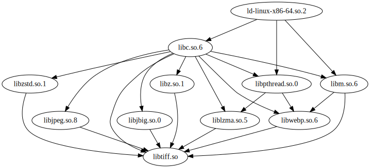

# lddtopo-rs

Uses [lddtree-rs](https://github.com/messense/lddtree-rs) to build the dependency graph of a provided library and run topological sort to get the order in which they should be loaded.

Usage:
```bash
RUST_LOG=info cargo run -- --shared-library-path /lib/x86_64-linux-gnu/libtiff.so --output-file /tmp/result.json
```
Then check the file /tmp/result.json and /tmp/result.dot
```bash
➜  lddtopo-rs git:(main) ✗ jq -r '.topo_sorted_libs' /tmp/result.json
[
  {
    "name": "ld-linux-x86-64.so.2",
    "path": "/lib/x86_64-linux-gnu/ld-linux-x86-64.so.2"
  },
  {
    "name": "libc.so.6",
    "path": "/lib/x86_64-linux-gnu/libc.so.6"
  },
  {
    "name": "libpthread.so.0",
    "path": "/lib/x86_64-linux-gnu/libpthread.so.0"
  },
  {
    "name": "libm.so.6",
    "path": "/lib/x86_64-linux-gnu/libm.so.6"
  },
  {
    "name": "libz.so.1",
    "path": "/lib/x86_64-linux-gnu/libz.so.1"
  },
  {
    "name": "libjpeg.so.8",
    "path": "/lib/x86_64-linux-gnu/libjpeg.so.8"
  },
  {
    "name": "libjbig.so.0",
    "path": "/lib/x86_64-linux-gnu/libjbig.so.0"
  },
  {
    "name": "liblzma.so.5",
    "path": "/lib/x86_64-linux-gnu/liblzma.so.5"
  },
  {
    "name": "libzstd.so.1",
    "path": "/lib/x86_64-linux-gnu/libzstd.so.1"
  },
  {
    "name": "libwebp.so.6",
    "path": "/lib/x86_64-linux-gnu/libwebp.so.6"
  },
  {
    "name": "libtiff.so",
    "path": "/lib/x86_64-linux-gnu/libtiff.so"
  }
]

```

The DAG (file /tmp/result.dot) on my machine looks like

